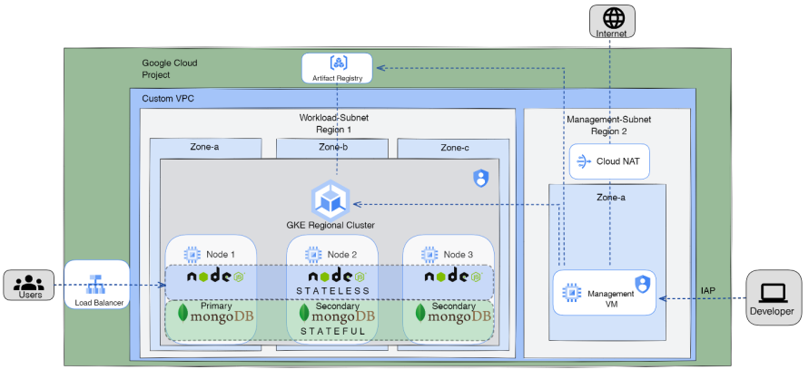

# GCP ITI Project 🎯

This project showcases the deployment of a highly available MongoDB replicaset across three zones and a stateless Node.js web application interacting with the MongoDB replicas. The infrastructure is built using Terraform modules on Google Cloud Platform (GCP). Below are the details of the project components and how to deploy them.



# You wanna your App like this   ⁉️ " just follow me 😉 "
https://github.com/AbdelrhmanEzzat/GCP-O231-FinalProject/assets/64223277/05259859-9869-4106-9cf8-9e8abf592c1e

## Project Components 📦

1. **IAM:**
   - Two service accounts are created with specific roles to manage permissions effectively.

2. **Networking:**
   - One VPC with two subnets is established.
   - Necessary firewall rules are configured & IAP.
   - NAT gateway is set up for outbound internet access.

3. **Compute:**
   - One private VM is created for specific purposes.
   - A GKE standard cluster is established across three zones.

4. **Storage:**
   - Artifact Registry repository is set up to store Docker images.

5. **MongoDB Replicaset:**
   - MongoDB is deployed as a replicaset across three zones with one primary and two secondaries for high availability.

6. **Node.js Web Application:**
   - A stateless Node.js web application is Dockerized and deployed. It connects to the MongoDB replicas for data operations.

7. **Ingress/Load Balancer:**
   - The web application is exposed using Kubernetes Ingress or Load Balancer services for external access.

## Deployment Steps 🚀

1. **Set Up Google Cloud Project:**
   - Create a new project on GCP or use an existing one.
   - Enable necessary APIs, including Compute Engine, Kubernetes Engine, Artifact Registry, and IAM.

2. **Terraform Deployment:**
   - Navigate to the `terraform/` directory.
   - Modify `variables.tf` file with appropriate values.
   - Run `terraform init` to initialize the Terraform configuration.
   - Run `terraform apply` to create the infrastructure components.
   
3. **MongoDB Replicaset Deployment:**
   - Follow the MongoDB deployment instructions provided in the `mongo/` directory.
   - Ensure the replicaset is configured correctly with primary and secondary nodes.

4. **Dockerize and Deploy Node.js Web Application:**
   - Navigate to the `app/` directory.
   - Dockerize the Node.js application using a Dockerfile.
   - Push the Docker image to the Artifact Registry repository.
   - Deploy the application on GKE using Kubernetes manifests in the `k8s/` directory.

5. **Expose the Web Application:**
   - Use Kubernetes Ingress or Load Balancer service to expose the web application to the external world.
   - Configure necessary DNS records if required.

## Clean Up

To avoid incurring charges, make sure to destroy the resources after testing and experimentation. Run `terraform destroy` in the `terraform/` directory to delete all created resources.

**Note:** Ensure that you have the necessary authentication and permissions to perform these actions on Google Cloud Platform.

Feel free to reach out if you have any questions or issues during the deployment process. Happy coding!


# Run steps

1. **Set Up Google Cloud Project:**
   - Create a new project on GCP or use an existing one.
   - Enable necessary APIs, including Compute Engine, Kubernetes Engine, Artifact Registry, and IAM.

2. **Terraform Deployment:**
 
   - Navigate to the `terraform/` directory.
   - Modify `variables.tf` file with appropriate values.
   - Run `terraform init` to initialize the Terraform configuration.

      ```
         terraform apply -var-file tf-dev.tfvars -lock=false
      ```

3. **MongoDB Replicaset Deployment:**


4. **Dockerize and Deploy Node.js Web Application:**
   (You can use this way)
   - Navigate to the `app/` directory.
   - Dockerize the Node.js application using a Dockerfile.
   - Push the Docker image to the Artifact Registry repository.

   (Or this this way 'from VM')
   -  Use Dockerfile for node.js app to build it image and push it to AR after connect to your VM

      ```
         docker build -t asia-east1-docker.pkg.dev/first-project-gcp-course/my-repository/node-app .
         gcloud auth configure-docker asia-east1-docker.pkg.dev
         docker push asia-east1-docker.pkg.dev/first-project-gcp-course/my-repository/node-app
      ```
      Use Dockerfile for mongoDB app to build it image and push it to AR
      ```
         docker build -t asia-east1-docker.pkg.dev/first-project-gcp-course/my-repository/mongo:5.0.15 .
         gcloud auth configure-docker asia-east1-docker.pkg.dev
         docker push asia-east1-docker.pkg.dev/first-project-gcp-course/my-repository/mongo:5.0.15
      ```

5. **Access you managment VM to apply deployment and services and all file you need to deploy your DB and Node.js**
      ```   
         kubectl apply -f statefulset.yaml 
         kubectl apply -f headless-service.yaml 
         kubectl apply -f mongo-configmap.yaml 
         kubectl apply -f mongo-secret.yaml
         kubectl apply -f googlecloud_ssd.yaml

         kubectl delete -f app-deployment-svc.yaml 
         kubectl apply -f app-deployment-svc.yaml
      ```
6. **Setup for mongoDB**

    ```
      kubectl exec -ti mongo-0 -- mongo
   ```
    
    ```
      rs.initiate(
      {
         _id: "rs0",
         version: 1,
         members: [
            { _id: 0, host : "mongo-0.mongo.default.svc.cluster.local:27017" },
            { _id: 1, host : "mongo-1.mongo.default.svc.cluster.local:27017" },
            { _id: 2, host : "mongo-2.mongo.default.svc.cluster.local:27017" }
         ]
      }
   )
   ```
  
   ```
         db.createUser(
            {
              user: "admin",
              pwd: "1234",
              roles: [
                { role: "readWrite", db: "exampledb" }
              ]
            }
          );
   ```
6. **Now you can access the node pods and you will see LoadBalancer IP to interact with app**

